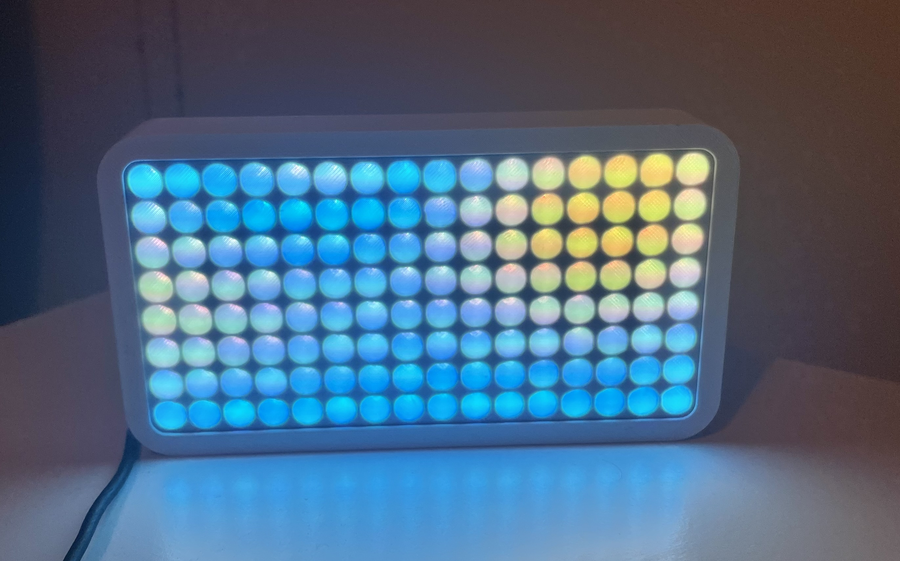

# Projects

This file demonstrates the projects that work with this code and how to declare them.

### 6x6 Display Project


```cpp
// Create an instance of the project
Project *myProject = new Grid("16x8 Grid",10, NEO_GRB, NEO_KHZ800,
6, 6, ROTATION_270, ROW_MAJOR);

// in setup()
myProject->init();
myProject->addWifi("...", "...");
```

### 16x8 Clock Project
```cpp
// Create an instance of the project
Project *myProject = new Grid("16x8 Grid",4, NEO_GRB, NEO_KHZ800,
                              16, 8, ROTATION_0, ROW_MAJOR);

// in setup()
myProject->init();
myProject->addAudioAnalysis(14, 15, 32, false);
myProject->addWifi("...", "...");
```
